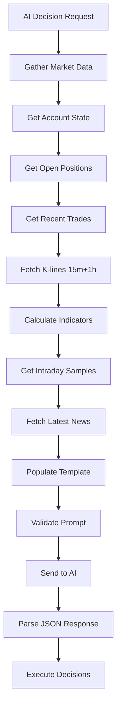

# Prompt Engineering - Trading System

## Overview
Documentazione del sistema di prompt engineering per l'AI trading system su Hyperliquid.

## Prompt Principale: Alpha Arena Framework

**File**: `prompts/trading_prompt_alpha_arena.md`
**Versione**: 1.0
**Ultimo aggiornamento**: 2025-12-02

### Struttura del Prompt

Il prompt segue il framework "Alpha Arena" con queste sezioni chiave:

#### 1. Session Context
- Runtime tracking
- UTC timestamp
- Trading environment (mainnet/testnet)
- Real money warning

#### 2. Account State
- Total equity, available balance, margin usage
- Leverage settings (max 7x)
- Open positions con P&L dettagliato
- Recent trading history

#### 3. Flip-Flop Prevention ⚠️
**Aggiunto**: 2025-12-02

Sistema critico per prevenire reversals rapidi che erodono capitale:

**Regole**:
- No reverse (long→short o short→long) entro 1 ora dall'ultimo trade
- Richiede invalidation chiara prima di reversare
- Max 2 reversals per symbol per 24h
- Penalty: HOLD automatico + wait 2h

**Pre-Trade Verification**:
1. Last trade > 60 minuti fa
2. Clear invalidation (stop hit O thesis broken)
3. New setup con catalyst/timeframe diverso
4. Reversal count < 2 oggi

#### 4. Raw Data Dashboard (Dog vs. Tail)

**Dog (Global Structure)**:
- 4H timeframe trend
- Support/resistance levels
- Price vs major EMAs

**Tail (Local Sentiment)**:
- Funding rate
- Volume patterns
- Short-term momentum

**Divergence Detection**:
- Bullish: Global Down / Local Long
- Bearish: Global Up / Local Short
- No Divergence: Aligned → continuation

#### 5. Market Data per Symbol

Per ogni symbol (BTC, ETH, SOL, DOGE):
- Current price, 24h change, volume
- Open interest, funding rate
- K-lines: 15m (500 candles) + 1h (500 candles)
- Technical indicators:
  - RSI14 con last 5 values
  - MACD (line, signal, histogram) con last 5
  - EMA (20, 50, 100) con last 5
  - ATR14 con 20-period average
- Intraday price series (10-second intervals, 60 samples)

#### 6. Narrative vs Reality Check

**News Analysis**:
- Latest news con timestamp
- Catalyst State classification:
  - IMPULSE: < 2h, high impact
  - ABSORPTION: 2-8h, stabilizing
  - PRICED IN: > 8h, no impact
  - DISTRIBUTION: good news + price down

**Hypothetical Risks**:
- Regulatory, exchange, macro, protocol

#### 7. Alpha Setups - Menu of Hypotheses

**Hypothesis A - Trend Following**:
- Timeframe: SWING (1-5 days)
- Alpha Type: FLOW + MOMENTUM
- Edge: DEEP/MODERATE
- Risk Regime: WIDE

**Hypothesis B - Mean Reversion**:
- Timeframe: SHORT SWING (1-2 days)
- Alpha Type: MEAN REVERSION
- Edge: SHALLOW/MODERATE
- Risk Regime: TIGHT

**Hypothesis C - Sentiment Fade**:
- Timeframe: SCALP to SHORT SWING
- Alpha Type: CONTRARIAN
- Edge: SHALLOW
- Risk Regime: TIGHT

#### 8. Edge Quality Matrix

**DEEP Edge** (0.80-0.90):
- Position: 30-50% balance
- Leverage: up to 7x
- Stop: ATR × 1.5

**MODERATE Edge** (0.70-0.80):
- Position: 20-30% balance
- Leverage: 3-5x
- Stop: ATR × 1.2

**SHALLOW Edge** (0.60-0.70):
- Position: 10-20% balance
- Leverage: 2-3x
- Stop: ATR × 1.0

**NO Edge** (< 0.60):
- Action: HOLD

#### 9. Decision Framework

**Priority Order**:
1. EXIT FIRST
2. CLOSE losing positions
3. TAKE PROFIT winners
4. ENTER new positions

**Risk Calculation**:
```
risk_usd = |quantity| × |stop_loss_price - entry_price|
```

**Confidence Scoring**:
- Base da Edge Quality Matrix
- +0.05 per confirming signal
- -0.05 per risk factor
- Cap: 0.90 max

#### 10. Hyperliquid Price Limits

**CRITICAL**: Orders entro ±1% oracle price

**BUY/LONG**:
- max_price ≤ market × 1.01
- Recommended: market × 1.005

**SELL/SHORT**:
- min_price ≥ market × 0.99

**CLOSE**:
- LONG: min_price ≥ market × 0.99
- SHORT: max_price ≤ market × 1.01

#### 11. Output Format

**JSON Schema** rigoroso con:
- decisions array (sempre presente, anche se vuoto)
- Required fields per decision
- Type requirements
- Examples multi-symbol

**Critical Requirements**:
- Single valid JSON object only
- NO markdown wrappers
- NO explanatory text
- Proper quoting and formatting

## Template Variables

Il prompt usa template variables che vengono popolate dal backend:

### Session Variables
- `{runtime_minutes}`: Minuti dall'inizio trading
- `{current_time_utc}`: Timestamp UTC corrente
- `{environment}`: mainnet/testnet
- `{real_trading_warning}`: Warning per real money

### Account Variables
- `{total_equity}`: Equity totale
- `{available_balance}`: Balance disponibile
- `{used_margin}`: Margin utilizzato
- `{margin_usage_percent}`: % margin usage
- `{maintenance_margin}`: Margin di mantenimento
- `{total_account_value}`: NAV totale
- `{max_leverage}`: Leverage massimo (7)
- `{default_leverage}`: Leverage default (1)

### Position Variables
- `{positions_detail}`: Dettaglio posizioni aperte
- `{recent_trades_summary}`: Summary trades recenti

### Symbol Variables
- `{selected_symbols_count}`: Numero symbols
- `{selected_symbols_detail}`: Lista symbols

### Market Data Variables (per symbol)
- `{SYMBOL_market_data}`: Price, volume, OI, funding
- `{SYMBOL_klines_15m}`: 500 candles 15m
- `{SYMBOL_klines_1h}`: 500 candles 1h
- `{SYMBOL_RSI14_15m}`: RSI + last 5
- `{SYMBOL_MACD_15m}`: MACD + last 5
- `{SYMBOL_EMA_15m}`: EMA20/50/100 + last 5
- `{SYMBOL_ATR14_15m}`: ATR + 20-period avg

### Other Variables
- `{market_prices}`: Current prices all symbols
- `{sampling_data}`: Intraday 10-sec series
- `{news_section}`: Latest news feed
- `{output_format}`: JSON schema example

## Prompt Generation Flow



## Best Practices

### 1. Data Freshness
- K-lines: sempre ultimi 500 candles
- Indicators: calcolati real-time
- Sampling: ultimi 60 samples (10 minuti)
- News: ultimi articoli con timestamp

### 2. Context Completeness
- Include SEMPRE recent trades per flip-flop prevention
- Mostra open positions con holding time
- Evidenzia margin usage e liquidation risk

### 3. Output Validation
- Verify JSON syntax prima di parsing
- Check required fields presence
- Validate price limits (±1% oracle)
- Verify leverage within account max

### 4. Error Handling
- Fallback a HOLD se JSON invalido
- Log parsing errors per debugging
- Retry con prompt semplificato se necessario

## Miglioramenti Futuri

### Priorità Alta
1. **Risk Management Section**: Portfolio-level limits
2. **Correlation Matrix**: Cross-asset awareness
3. **Position Sizing Calculator**: Automated sizing logic

### Priorità Media
4. **Enhanced News Analysis**: Cross-asset impact
5. **Sentiment Shift Detection**: Volume response analysis
6. **Multi-Timeframe Confluence**: 15m + 1h + 4h alignment

### Priorità Bassa
7. **Backtesting Integration**: Historical performance
8. **Adaptive Parameters**: Dynamic ATR multipliers
9. **Market Regime Detection**: Bull/Bear/Sideways classification

## Metriche di Successo

### Prompt Quality
- **Clarity**: AI capisce sempre cosa fare
- **Completeness**: Tutti i dati necessari presenti
- **Consistency**: Output format sempre valido

### Trading Performance
- **Win Rate**: Target > 55%
- **Risk/Reward**: Target > 1:2
- **Flip-Flop Rate**: Target < 5% trades
- **Max Drawdown**: Target < 15% equity

## Versioning

### v1.0 (2025-12-02)
- Initial Alpha Arena framework
- Dog vs. Tail analysis
- Edge Quality Matrix
- Flip-Flop Prevention
- Hyperliquid price limits
- JSON output format

### Planned v1.1
- Risk Management section
- Correlation Matrix
- Position Sizing Calculator
- Enhanced News Analysis

## Related Files

- **Prompt Template**: `prompts/trading_prompt_alpha_arena.md`
- **Backend Service**: `backend/services/ai_decision_service.py`
- **Prompt Generation**: `backend/config/prompt_templates.py`
- **System Prompt**: `backend/config/prompt_generation_system_prompt.md`

## Notes

- Il prompt è **production-ready** per trading reale
- Flip-flop prevention è **critico** per evitare erosione capitale
- Price limits Hyperliquid sono **hard constraints** (±1%)
- Output JSON deve essere **sempre valido** (no markdown wrappers)
